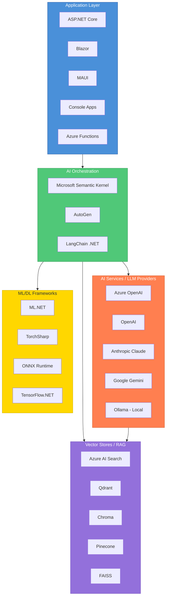

# AI Engineer Learning Path

I've been a software engineer for quite some time now, and like many of us in the industry, I realised that AI isn't just a buzzword anymore - it's becoming essential. So I put together this learning roadmap for myself (and anyone else in a similar boat) to make this transition systematically.

The idea is simple: we already know how to code, we understand software architecture, and we've shipped production systems. Now we just need to bridge the gap to AI/ML. This isn't about starting from scratch - it's about building on what we already know.

---

## Phase 1: Getting the Basics Right (Weeks 1-4)

Honestly, this is the part most of us dread - going back to maths! But trust me, you don't need a PhD. Just enough to understand what's happening under the hood.

### 1.1 AI/ML Fundamentals
- [ ] **Maths Refresher**
  - Linear Algebra (vectors, matrices - basically how ML sees data)
  - Calculus (derivatives, gradients - how models learn)
  - Probability & Statistics (the backbone of ML predictions)
  
  **Videos That Actually Make Sense:**
  - [3Blue1Brown - Essence of Linear Algebra](https://www.youtube.com/playlist?list=PLZHQObOWTQDPD3MizzM2xVFitgF8hE_ab)
  - [3Blue1Brown - Essence of Calculus](https://www.youtube.com/playlist?list=PLZHQObOWTQDMsr9K-rj53DwVRMYO3t5Yr)
  - [StatQuest - Statistics Fundamentals](https://www.youtube.com/playlist?list=PLblh5JKOoLUK0FLuzwntyYI10UQFUhsY9)
  - [Khan Academy - Linear Algebra](https://www.khanacademy.org/math/linear-algebra)
  
  **Articles:**
  - [Mathematics for Machine Learning Book (Free PDF)](https://mml-book.github.io/)
  - [The Matrix Calculus You Need For Deep Learning](https://arxiv.org/abs/1802.01528)

- [ ] **Machine Learning Basics** (The actual fun part begins here)
  - Supervised vs Unsupervised Learning - know the difference, it comes up everywhere
  - Classification, Regression, Clustering - your bread and butter
  - Model evaluation metrics (precision, recall, F1, AUC) - how to know if your model is rubbish or not
  - Overfitting, underfitting, cross-validation - common pitfalls we all face
  
  **Videos Worth Your Time:**
  - [Andrew Ng's Machine Learning Specialization](https://www.coursera.org/specializations/machine-learning-introduction)
  - [StatQuest - Machine Learning](https://www.youtube.com/playlist?list=PLblh5JKOoLUICTaGLRoHQDuF_7q2GfuJF)
  - [Sentdex - Machine Learning with Python](https://www.youtube.com/playlist?list=PLQVvvaa0QuDfKTOs3Keq_kaG2P55YRn5v)
  
  **Reading Material:**
  - [Google's Machine Learning Crash Course](https://developers.google.com/machine-learning/crash-course)
  - [ML.NET Documentation](https://learn.microsoft.com/en-us/dotnet/machine-learning/)
  - [Scikit-learn User Guide](https://scikit-learn.org/stable/user_guide.html)

### 1.2 Python for AI

Most AI research, tutorials, and libraries are Python-first. Think of it as adding another tool to your belt.

- [ ] **Python Essentials** (It's easier than you think, coming from C#)
  - Python syntax - you'll pick it up fast, trust me
  - NumPy, Pandas - these are genuinely brilliant for data work
  - Jupyter Notebooks - interactive coding, great for experimentation
  - Virtual environments (venv, conda) - package management sorted
  
  **Videos I Found Helpful:**
  - [Corey Schafer - Python Tutorials](https://www.youtube.com/playlist?list=PL-osiE80TeTt2d9bfVyTiXJA-UTHn6WwU)
  - [freeCodeCamp - Python for Data Science](https://www.youtube.com/watch?v=LHBE6Q9XlzI)
  - [NumPy Tutorial - Keith Galli](https://www.youtube.com/watch?v=QUT1VHiLmmI)
  - [Pandas Tutorial - Corey Schafer](https://www.youtube.com/playlist?list=PL-osiE80TeTsWmV9i9c58mdDCSskIFdDS)
  
  **Articles & Docs:**
  - [RealPython](https://realpython.com/)
  - [NumPy Quickstart](https://numpy.org/doc/stable/user/quickstart.html)
  - [10 Minutes to Pandas](https://pandas.pydata.org/docs/user_guide/10min.html)

- [ ] **C# ML Ecosystem** (Our home ground!)
  - ML.NET - Microsoft's own ML framework, works great with .NET
  - ONNX Runtime - run models trained in Python inside your C# apps
  - TorchSharp - PyTorch but in C#, pretty neat
  - Semantic Kernel - this is the real deal for building AI apps
  
  **Videos:**
  - [ML.NET Tutorial - Microsoft](https://www.youtube.com/playlist?list=PLdo4fOcmZ0oX-DBuRG4u58ZTAJgBAeQ-t)
  - [.NET AI with Semantic Kernel](https://www.youtube.com/watch?v=S7Mz7uXAn9E)
  - [TorchSharp Getting Started](https://www.youtube.com/watch?v=nbIE-F7sCxM)
  
  **Documentation:**
  - [ML.NET Docs](https://learn.microsoft.com/en-us/dotnet/machine-learning/)
  - [Semantic Kernel Docs](https://learn.microsoft.com/en-us/semantic-kernel/overview/)
  - [ONNX Runtime for .NET](https://onnxruntime.ai/docs/get-started/with-csharp.html)

---

## Phase 2: Deep Learning - Where the Magic Happens (Weeks 5-10)

This is where it gets exciting. Neural networks, deep learning - the stuff that powers ChatGPT, image recognition, and all those fancy AI applications we see daily.

### 2.1 Neural Network Fundamentals
- [ ] **Core Concepts** (Get these right, and everything else will make sense)
  - Perceptrons and activation functions - the building blocks
  - Backpropagation and gradient descent - how networks learn (this took me a while to truly get)
  - Loss functions and optimizers - guiding the learning process
  - Regularisation techniques (dropout, batch norm) - preventing overfitting
  
  **Must-Watch Videos:**
  - [3Blue1Brown - Neural Networks](https://www.youtube.com/playlist?list=PLZHQObOWTQDNU6R1_67000Dx_ZCJB-3pi)
  - [Andrej Karpathy - Neural Networks: Zero to Hero](https://www.youtube.com/playlist?list=PLAqhIrjkxbuWI23v9cThsA9GvCAUhRvKZ)
  - [StatQuest - Neural Networks](https://www.youtube.com/playlist?list=PLblh5JKOoLUIxGDQs4LFFD--41Vzf-ME1)
  - [Deep Learning Fundamentals - deeplizard](https://www.youtube.com/playlist?list=PLZbbT5o_s2xq7LwI2y8_QtvuXZedL6tQU)
  
  **Reading:**
  - [Neural Networks and Deep Learning (Free Book)](http://neuralnetworksanddeeplearning.com/)
  - [CS231n Course Notes (Stanford)](https://cs231n.github.io/)
  - [Colah's Blog](https://colah.github.io/)

- [ ] **Architectures** (Know when to use what)
  - Feedforward Neural Networks - the simplest form
  - Convolutional Neural Networks (CNNs) - brilliant for images
  - Recurrent Neural Networks (RNNs, LSTMs) - for sequential data
  - Attention mechanisms - the foundation of modern AI, this changed everything
  
  **University-Level Content (Free!):**
  - [MIT 6.S191 - Intro to Deep Learning](https://www.youtube.com/playlist?list=PLtBw6njQRU-rwp5__7C0oIVt26ZgjG9NI)
  - [Stanford CS231n - CNNs for Visual Recognition](https://www.youtube.com/playlist?list=PL3FW7Lu3i5JvHM8ljYj-zLfQRF3EO8sYv)
  - [Stanford CS224n - NLP with Deep Learning](https://www.youtube.com/playlist?list=PLoROMvodv4rOSH4v6133s9LFPRHjEmbmJ)
  - [Attention Mechanism Explained - Rasa](https://www.youtube.com/watch?v=yGTUuEx3GkA)
  
  **Articles That Clicked for Me:**
  - [Understanding LSTMs - Colah](https://colah.github.io/posts/2015-08-Understanding-LSTMs/)
  - [The Illustrated Transformer - Jay Alammar](https://jalammar.github.io/illustrated-transformer/)
  - [CNN Explainer - Interactive](https://poloclub.github.io/cnn-explainer/)

### 2.2 Deep Learning Frameworks

You'll need to pick at least one. My recommendation? Start with PyTorch - it's more intuitive and the debugging is much easier.

- [ ] **PyTorch** (My recommendation - more Pythonic, easier to debug)
  - Tensors and autograd - the core concepts
  - Building custom models - where you get creative
  - Training loops and evaluation - the practical bits
  
  **Video Resources:**
  - [PyTorch Official Tutorials](https://pytorch.org/tutorials/)
  - [freeCodeCamp - PyTorch for Deep Learning](https://www.youtube.com/watch?v=V_xro1bcAuI)
  - [Aladdin Persson - PyTorch Tutorials](https://www.youtube.com/playlist?list=PLhhyoLH6IjfxeoooqP9rhU3HJIAVAJ3Vz)
  - [Daniel Bourke - Learn PyTorch](https://www.youtube.com/watch?v=Z_ikDlimN6A)
  
  **Reading:**
  - [PyTorch 60 Minute Blitz](https://pytorch.org/tutorials/beginner/deep_learning_60min_blitz.html)
  - [Learn PyTorch (Free Book)](https://www.learnpytorch.io/)
  - [PyTorch Lightning Docs](https://lightning.ai/docs/pytorch/stable/)

- [ ] **TensorFlow/Keras** (Good for production, widely used in industry)
  - Keras APIs - Sequential and Functional
  - TensorFlow Serving - for deployment
  
  **Video Tutorials:**
  - [TensorFlow in 10 Hours - freeCodeCamp](https://www.youtube.com/watch?v=tPYj3fFJGjk)
  - [Keras with TensorFlow - Deeplizard](https://www.youtube.com/playlist?list=PLZbbT5o_s2xrwRnXk_yCPtnqqo4_u2YGL)
  - [TensorFlow Developer Certificate Prep](https://www.youtube.com/watch?v=tPYj3fFJGjk)
  
  **Articles:**
  - [TensorFlow Official Tutorials](https://www.tensorflow.org/tutorials)
  - [Keras Documentation](https://keras.io/guides/)

- [ ] **.NET Deep Learning**
  - TorchSharp for PyTorch in C#
  - ONNX model inference in .NET
  - ML.NET deep learning integrations
  
  **Video Tutorials:**
  - [TorchSharp Tutorial - .NET Foundation](https://www.youtube.com/watch?v=gHRDnEb8mEw)
  - [ONNX Runtime in .NET](https://www.youtube.com/watch?v=yVbKxqslAIA)
  
  **Articles:**
  - [TorchSharp GitHub Examples](https://github.com/dotnet/TorchSharp)
  - [ONNX Runtime C# API](https://onnxruntime.ai/docs/api/csharp/api/index.html)
  - [Deep Learning with ML.NET](https://learn.microsoft.com/en-us/dotnet/machine-learning/how-to-guides/train-machine-learning-model-ml-net)

---

## Phase 3: Large Language Models & NLP (Weeks 11-18)

This is where things get really interesting. LLMs are what's driving the current AI revolution - ChatGPT, Claude, Gemini. Understanding how these work will set you apart.

### 3.1 NLP Foundations
- [ ] **Text Processing** (The basics before we go deep)
  - Tokenisation, stemming, lemmatisation - how computers understand text
  - Word embeddings (Word2Vec, GloVe) - representing words as numbers
  - Sequence-to-sequence models - the precursor to modern LLMs
  
  **Videos:**
  - [Stanford CS224n - NLP with Deep Learning](https://www.youtube.com/playlist?list=PLoROMvodv4rOSH4v6133s9LFPRHjEmbmJ)
  - [Hugging Face NLP Course](https://huggingface.co/learn/nlp-course)
  - [NLP Zero to Hero - TensorFlow](https://www.youtube.com/playlist?list=PLQY2H8rRoyvzDbLUZkbudP-MFQZwNmU4S)
  - [Word Embeddings Explained - Luis Serrano](https://www.youtube.com/watch?v=5PL0TmQhItY)
  
  **Reading:**
  - [The Illustrated Word2Vec - Jay Alammar](https://jalammar.github.io/illustrated-word2vec/)
  - [Speech and Language Processing (Free Book)](https://web.stanford.edu/~jurafsky/slp3/)
  - [spaCy 101](https://spacy.io/usage/spacy-101)

- [ ] **Transformer Architecture** (This is THE architecture - everything modern is based on this)
  - Self-attention mechanism - the key innovation
  - Multi-head attention - parallelising attention
  - Positional encoding - how transformers understand sequence order
  - Encoder-decoder architecture - the original transformer design
  
  **Videos That Made It Click:**
  - [Attention Is All You Need - Yannic Kilcher](https://www.youtube.com/watch?v=iDulhoQ2pro)
  - [Transformer Neural Networks - CodeEmporium](https://www.youtube.com/watch?v=TQQlZhbC5ps)
  - [Let's Build GPT - Andrej Karpathy](https://www.youtube.com/watch?v=kCc8FmEb1nY)
  - [Transformers Explained - StatQuest](https://www.youtube.com/watch?v=zxQyTK8quyY)
  
  **Must-Read Articles:**
  - [The Illustrated Transformer - Jay Alammar](https://jalammar.github.io/illustrated-transformer/)
  - [The Illustrated GPT-2 - Jay Alammar](https://jalammar.github.io/illustrated-gpt2/)
  - [Attention? Attention! - Lil'Log](https://lilianweng.github.io/posts/2018-06-24-attention/)

### 3.2 Modern LLMs
- [ ] **Understanding LLMs** (Know what's under the hood)
  - GPT architecture and variants - the decoder-only approach
  - BERT and bidirectional models - good for understanding text
  - Scaling laws and emergent capabilities - why bigger sometimes means smarter
  - Context windows and tokenisation - practical limitations you'll encounter
  
  **Videos:**
  - [Andrej Karpathy - Intro to LLMs (1hr talk)](https://www.youtube.com/watch?v=zjkBMFhNj_g)
  - [State of GPT - Andrej Karpathy](https://www.youtube.com/watch?v=bZQun8Y4L2A)
  - [Large Language Models - MIT](https://www.youtube.com/watch?v=O5xeyoRL95U)
  - [BERT Explained - CodeEmporium](https://www.youtube.com/watch?v=xI0HHN5XKDo)
  
  **Reading:**
  - [The Illustrated GPT-2 - Jay Alammar](https://jalammar.github.io/illustrated-gpt2/)
  - [BERT Explained - Jay Alammar](https://jalammar.github.io/illustrated-bert/)
  - [LLM Survey Paper](https://arxiv.org/abs/2303.18223)
  - [LLM Visualisation (Interactive)](https://bbycroft.net/llm)

- [ ] **Working with LLM APIs** (The practical stuff - this is what you'll use daily)
  - Azure OpenAI Service - enterprise-grade, good for production
  - OpenAI API - the original, still very good
  - Anthropic Claude API - my personal favourite for coding tasks
  - Google Gemini API - solid alternative
  - Local models (Ollama, LM Studio) - run LLMs on your machine, no API costs!
  
  **Videos:**
  - [OpenAI API Tutorial - freeCodeCamp](https://www.youtube.com/watch?v=uRQH2CFvedY)
  - [Azure OpenAI Service - Microsoft](https://www.youtube.com/watch?v=3t3qZu1Dy1k)
  - [Ollama Tutorial - NetworkChuck](https://www.youtube.com/watch?v=Wjrdr0NU4Sk)
  - [Claude API Tutorial - Anthropic](https://www.youtube.com/watch?v=fANzjK0gqMo)
  
  **Documentation:**
  - [OpenAI API Docs](https://platform.openai.com/docs/introduction)
  - [Azure OpenAI Quickstart](https://learn.microsoft.com/en-us/azure/ai-services/openai/quickstart)
  - [Anthropic Claude Docs](https://docs.anthropic.com/)
  - [Ollama](https://ollama.ai/)

### 3.3 Prompt Engineering

This is a skill in itself. Good prompts can make average models perform brilliantly. Bad prompts will frustrate you endlessly.

- [ ] **Techniques** (Master these, they're genuinely useful)
  - Zero-shot, few-shot learning - teaching the model with examples
  - Chain-of-thought prompting - making the model "think" step by step
  - ReAct pattern - reasoning and acting together
  - Structured outputs (JSON mode) - getting predictable formats
  - System prompts and personas - setting context and behaviour
  
  **Videos:**
  - [ChatGPT Prompt Engineering - DeepLearning.AI](https://www.deeplearning.ai/short-courses/chatgpt-prompt-engineering-for-developers/)
  - [Advanced Prompt Engineering - Elvis Saravia](https://www.youtube.com/watch?v=dOxUroR57xs)
  - [Chain of Thought Prompting Explained](https://www.youtube.com/watch?v=H4J59iG3t5o)
  - [Prompt Engineering Full Course - freeCodeCamp](https://www.youtube.com/watch?v=mBYu5NoXBcs)
  
  **Reading:**
  - [Prompt Engineering Guide](https://www.promptingguide.ai/)
  - [OpenAI Prompt Engineering Guide](https://platform.openai.com/docs/guides/prompt-engineering)
  - [Anthropic Prompt Engineering](https://docs.anthropic.com/claude/docs/prompt-engineering)
  - [Chain-of-Thought Paper](https://arxiv.org/abs/2201.11903)

---

## Phase 4: Building Real AI Applications (Weeks 19-26)

Alright, now we get to build actual stuff! This is where your software engineering background really shines. We know how to ship products - now let's ship AI products.

### 4.1 Semantic Kernel & AI Orchestration

If you're coming from .NET, Semantic Kernel is your best friend. Microsoft built this specifically for us.

- [ ] **Microsoft Semantic Kernel** (Essential for .NET AI apps)
  - Kernels, plugins, and functions - the building blocks
  - Planners and automatic orchestration - let AI decide how to solve problems
  - Memory and embeddings - giving your app context
  - Connectors (OpenAI, Azure, Hugging Face) - plug and play with different providers
  
  **Videos:**
  - [Semantic Kernel Explained - Microsoft](https://www.youtube.com/watch?v=S7Mz7uXAn9E)
  - [Building AI Apps with Semantic Kernel](https://www.youtube.com/watch?v=F2sM2MagViY)
  - [Semantic Kernel Deep Dive - John Maeda](https://www.youtube.com/watch?v=rHg7Wh8jJi8)
  - [.NET AI Apps - Scott Hanselman](https://www.youtube.com/watch?v=R3qhJqt8pYI)
  
  **Documentation:**
  - [Semantic Kernel Docs](https://learn.microsoft.com/en-us/semantic-kernel/overview/)
  - [Semantic Kernel Samples](https://github.com/microsoft/semantic-kernel/tree/main/dotnet/samples)
  - [Quickstart Guide](https://learn.microsoft.com/en-us/semantic-kernel/get-started/quick-start-guide)

```csharp
// Example: Basic Semantic Kernel setup
using Microsoft.SemanticKernel;

var kernel = Kernel.CreateBuilder()
    .AddAzureOpenAIChatCompletion(
        deploymentName: "gpt-4",
        endpoint: "https://your-resource.openai.azure.com",
        apiKey: "your-key")
    .Build();

var result = await kernel.InvokePromptAsync("Explain quantum computing simply");
```

### 4.2 Retrieval-Augmented Generation (RAG)

RAG is probably the most practical AI pattern you'll implement. It lets you give LLMs access to your own data without expensive fine-tuning. Think of it as "teaching" the model about your documents at runtime.

- [ ] **Vector Databases** (Where you store your embeddings)
  - Embeddings and similarity search - the core concept
  - Azure AI Search - Microsoft's offering, integrates well with Azure
  - Pinecone, Weaviate, Qdrant - popular managed options
  - Chroma, FAISS - for local development and testing
  
  **Videos:**
  - [RAG Explained - IBM Technology](https://www.youtube.com/watch?v=T-D1OfcDW1M)
  - [Vector Databases Explained - Fireship](https://www.youtube.com/watch?v=klTvEwg3oJ4)
  - [Building RAG Applications - DeepLearning.AI](https://www.deeplearning.ai/short-courses/building-evaluating-advanced-rag/)
  - [Pinecone RAG Tutorial](https://www.youtube.com/watch?v=LhnCsygAvzY)
  
  **Reading:**
  - [RAG Survey Paper](https://arxiv.org/abs/2312.10997)
  - [Azure AI Search Docs](https://learn.microsoft.com/en-us/azure/search/search-what-is-azure-search)
  - [Pinecone Learning Centre](https://www.pinecone.io/learn/)
  - [Chroma Docs](https://docs.trychroma.com/)

- [ ] **RAG Implementation** (The nitty-gritty)
  - Document chunking strategies - how to split your documents
  - Embedding generation - converting text to vectors
  - Hybrid search (keyword + semantic) - best of both worlds
  - Re-ranking and filtering - improving result quality
  
  **Videos:**
  - [Advanced RAG Techniques - LangChain](https://www.youtube.com/watch?v=sVcwVQRHIc8)
  - [RAG from Scratch - LangChain](https://www.youtube.com/playlist?list=PLfaIDFEXuae2LXbO1_PKyVJiQ23ZztA0x)
  - [Semantic Kernel RAG Tutorial](https://www.youtube.com/watch?v=z1x2E7bsMyk)
  
  **Reading:**
  - [Chunking Strategies for RAG](https://www.pinecone.io/learn/chunking-strategies/)
  - [LangChain RAG Tutorial](https://python.langchain.com/docs/tutorials/rag/)
  - [RAG with Semantic Kernel](https://learn.microsoft.com/en-us/semantic-kernel/concepts/vector-store-connectors/)

```csharp
// Example: RAG with Semantic Kernel
#pragma warning disable SKEXP0001
var memoryBuilder = new MemoryBuilder()
    .WithAzureOpenAITextEmbeddingGeneration("text-embedding-ada-002", endpoint, apiKey)
    .WithMemoryStore(new VolatileMemoryStore())
    .Build();

await memoryBuilder.SaveInformationAsync("docs", "Your document content", "doc1");
var results = await memoryBuilder.SearchAsync("docs", "query", limit: 5);
```

### 4.3 AI Agents & Autonomous Systems

This is the frontier right now. Agents can use tools, reason about problems, and take actions. It's like giving the LLM hands and feet.

- [ ] **Agent Fundamentals** (Understand the concepts first)
  - Tool use and function calling - letting AI use your APIs
  - Agent loops and reasoning - how agents "think"
  - Multi-agent systems - multiple AI agents working together
  - Planning and task decomposition - breaking complex problems down
  
  **Videos:**
  - [Building AI Agents - DeepLearning.AI](https://www.deeplearning.ai/short-courses/ai-agents-in-langgraph/)
  - [What are AI Agents? - IBM Technology](https://www.youtube.com/watch?v=F8NKVhkZZWI)
  - [Multi-Agent Systems - DeepLearning.AI](https://www.deeplearning.ai/short-courses/multi-ai-agent-systems-with-crewai/)
  - [Function Calling Explained - Sam Witteveen](https://www.youtube.com/watch?v=0lOSvOoF2to)
  
  **Reading:**
  - [LLM Powered Autonomous Agents - Lil'Log](https://lilianweng.github.io/posts/2023-06-23-agent/)
  - [OpenAI Function Calling Guide](https://platform.openai.com/docs/guides/function-calling)
  - [Building LLM Agents - LangChain](https://python.langchain.com/docs/tutorials/agents/)
  - [ReAct Pattern Paper](https://arxiv.org/abs/2210.03629)

- [ ] **Building Agents in .NET** (Our territory)
  - Azure AI Agent Service - Microsoft's managed service
  - AutoGen for .NET - Multi-agent framework
  - Custom agent implementations - when you need full control
  
  **Videos:**
  - [AutoGen Tutorial - Microsoft](https://www.youtube.com/watch?v=vU2S6dVf79M)
  - [Multi-Agent AI with AutoGen](https://www.youtube.com/watch?v=RLwyXRVvlNk)
  - [Building Agents with Semantic Kernel](https://www.youtube.com/watch?v=rH02LD89T-8)
  
  **Documentation:**
  - [AutoGen Docs](https://microsoft.github.io/autogen/)
  - [Azure AI Agent Service](https://learn.microsoft.com/en-us/azure/ai-services/agents/)
  - [Semantic Kernel Agents](https://learn.microsoft.com/en-us/semantic-kernel/concepts/agents)

```csharp
// Example: Function calling with Semantic Kernel
var getWeatherFunc = kernel.CreateFunctionFromMethod(
    (string city) => $"Weather in {city}: Sunny, 72°F",
    "GetWeather",
    "Gets the current weather for a city");

kernel.Plugins.AddFromFunctions("Weather", [getWeatherFunc]);
```

---

## Phase 5: MLOps & Production AI (Weeks 27-32)

As software engineers, we know that building is one thing - running in production is another. MLOps is where we apply our DevOps knowledge to ML systems.

### 5.1 Model Training & Fine-tuning
- [ ] **Fine-tuning Techniques** (When pre-trained isn't enough)
  - Transfer learning - use what's already been learnt
  - LoRA and QLoRA - efficient fine-tuning without breaking the bank
  - Prompt tuning - softer approach to customisation
  - RLHF basics - how ChatGPT became so helpful
  
  **Videos:**
  - [Fine-tuning LLMs - DeepLearning.AI](https://www.deeplearning.ai/short-courses/finetuning-large-language-models/)
  - [LoRA Explained - Umar Jamil](https://www.youtube.com/watch?v=PXWYUTMt-AU)
  - [QLoRA Fine-tuning Tutorial](https://www.youtube.com/watch?v=eeM6V5aPjhk)
  - [RLHF Explained - Hugging Face](https://www.youtube.com/watch?v=2MBJi6q2JZQ)
  
  **Reading:**
  - [Hugging Face PEFT Docs](https://huggingface.co/docs/peft/index)
  - [Fine-tuning Guide - Hugging Face](https://huggingface.co/docs/transformers/training)
  - [LoRA Paper](https://arxiv.org/abs/2106.09685)
  - [RLHF Blog - Hugging Face](https://huggingface.co/blog/rlhf)

- [ ] **Training Infrastructure** (The expensive bits)
  - GPU/TPU computing - you'll need these for training
  - Distributed training - when one GPU isn't enough
  - Azure Machine Learning - Microsoft's ML platform
  - Weights & Biases - experiment tracking (genuinely useful)
  
  **Videos:**
  - [Azure Machine Learning Tutorial](https://www.youtube.com/watch?v=VQ2PnPGIk4Q)
  - [Weights & Biases Tutorial](https://www.youtube.com/watch?v=G7GH0SeNBMA)
  - [Distributed Training - PyTorch](https://www.youtube.com/watch?v=Cvdhwx-OBBo)
  
  **Documentation:**
  - [Azure ML Docs](https://learn.microsoft.com/en-us/azure/machine-learning/)
  - [Weights & Biases Quickstart](https://docs.wandb.ai/quickstart)
  - [Distributed Training Guide - PyTorch](https://pytorch.org/tutorials/intermediate/ddp_tutorial.html)

### 5.2 Model Deployment
- [ ] **Deployment Strategies** (Getting models into production)
  - Model serving (TensorFlow Serving, TorchServe) - dedicated serving solutions
  - ONNX for cross-platform deployment - train in Python, deploy in C#
  - Containerisation (Docker) - we know this already
  - Kubernetes for scaling - again, familiar territory
  
  **Video Tutorials:**
  - [ML Model Deployment - Krish Naik](https://www.youtube.com/watch?v=bjsJOl8gz5k)
  - [Docker for ML - freeCodeCamp](https://www.youtube.com/watch?v=0UG2x2iAF7E)
  - [TorchServe Tutorial](https://www.youtube.com/watch?v=AIaRXJuMT7U)
  - [ONNX Runtime Deployment](https://www.youtube.com/watch?v=NBL2rXYa_-g)
  
  **Articles:**
  - [ML Deployment Guide - Made With ML](https://madewithml.com/courses/mlops/deployment/)
  - [TorchServe Documentation](https://pytorch.org/serve/)
  - [ONNX Runtime Performance](https://onnxruntime.ai/docs/performance/tune-performance/)

- [ ] **Azure AI Services**
  - Azure OpenAI Service
  - Azure Machine Learning endpoints
  - Azure AI Foundry
  - Azure Cognitive Services
  
  **Video Tutorials:**
  - [Azure AI Services Overview - Microsoft](https://www.youtube.com/watch?v=q18sGLnKXd0)
  - [Azure ML Endpoints Tutorial](https://www.youtube.com/watch?v=0b2g-Wl4JDE)
  - [Azure AI Foundry (AI Studio)](https://www.youtube.com/watch?v=qm3Mv7j4a-0)
  
  **Articles:**
  - [Azure AI Services Documentation](https://learn.microsoft.com/en-us/azure/ai-services/)
  - [Azure OpenAI Service](https://learn.microsoft.com/en-us/azure/ai-services/openai/)
  - [Azure AI Foundry Documentation](https://learn.microsoft.com/en-us/azure/ai-studio/)

### 5.3 MLOps Best Practices

This is where your software engineering experience becomes a superpower. CI/CD, testing, monitoring - we've done this before, just with a twist.

- [ ] **CI/CD for ML** (DevOps meets ML)
  - Model versioning (MLflow, DVC) - like Git, but for models and data
  - Automated testing for ML - it's trickier than regular testing
  - Model monitoring and drift detection - models degrade over time
  - A/B testing for models - which version performs better?
  
  **Videos:**
  - [MLOps Course - Made With ML](https://madewithml.com/)
  - [MLflow Tutorial - Databricks](https://www.youtube.com/watch?v=859OxXrt_TI)
  - [DVC Tutorial - Iterative](https://www.youtube.com/watch?v=kLKBcPonMYw)
  - [ML Testing - Google](https://www.youtube.com/watch?v=9uAEqVmPfqQ)
  
  **Reading:**
  - [MLOps Guide - Google](https://cloud.google.com/architecture/mlops-continuous-delivery-and-automation-pipelines-in-machine-learning)
  - [MLflow Docs](https://mlflow.org/docs/latest/index.html)
  - [DVC Docs](https://dvc.org/doc)
  - [ML Test Score - Google Paper](https://research.google/pubs/pub46555/)

```yaml
# Example: Azure ML Pipeline (YAML)
$schema: https://azuremlschemas.azureedge.net/latest/pipelineJob.schema.json
type: pipeline
display_name: training-pipeline
jobs:
  train:
    type: command
    code: ./src
    command: python train.py
    environment: azureml:AzureML-sklearn-1.0-ubuntu20.04-py38-cpu@latest
```

---

## Phase 6: Advanced Topics (Weeks 33-40)

By now you've got a solid foundation. This phase is about exploring specialisations and staying ahead of the curve.

### 6.1 Multimodal AI

AI isn't just about text anymore. Images, audio, video - everything's coming together.

- [ ] **Vision-Language Models** (AI that can "see")
  - GPT-4 Vision - image understanding built into GPT
  - CLIP and image embeddings - connecting images and text
  - Document AI and OCR - extracting text from documents
  
  **Video Tutorials:**
  - [Multimodal LLMs Explained - AI Jason](https://www.youtube.com/watch?v=vMteSfKCVrc)
  - [CLIP Explained - Yannic Kilcher](https://www.youtube.com/watch?v=T9XSU0pKX2E)
  - [GPT-4 Vision Tutorial](https://www.youtube.com/watch?v=PuBOT8YLdEs)
  - [Document AI with Azure](https://www.youtube.com/watch?v=vP0r7v4CMu8)
  
  **Articles:**
  - [CLIP Paper - OpenAI](https://openai.com/research/clip)
  - [GPT-4 Vision Guide](https://platform.openai.com/docs/guides/vision)
  - [Azure Document Intelligence](https://learn.microsoft.com/en-us/azure/ai-services/document-intelligence/)
  - [Multimodal AI Survey](https://arxiv.org/abs/2306.13549)

- [ ] **Audio & Speech**
  - Speech-to-text (Whisper)
  - Text-to-speech
  - Audio processing
  
  **Video Tutorials:**
  - [OpenAI Whisper Tutorial - Assembly AI](https://www.youtube.com/watch?v=s0P3K7D8VbA)
  - [Azure Speech Services](https://www.youtube.com/watch?v=qsNKx-5cQNY)
  - [Audio ML with Python](https://www.youtube.com/watch?v=iCwMQJnKk2c)
  
  **Articles:**
  - [Whisper Paper - OpenAI](https://openai.com/research/whisper)
  - [Azure Speech Service Docs](https://learn.microsoft.com/en-us/azure/ai-services/speech-service/)
  - [Speech-to-Text Best Practices](https://cloud.google.com/speech-to-text/docs/best-practices)

### 6.2 AI Safety & Responsible AI
- [ ] **Safety Considerations**
  - Prompt injection prevention
  - Content filtering
  - Jailbreak prevention
  - Output validation
  
  **Video Tutorials:**
  - [AI Safety Course - Center for AI Safety](https://course.mlsafety.org/)
  - [Prompt Injection Explained - OWASP](https://www.youtube.com/watch?v=PDX9Tf0E84k)
  - [LLM Security - DeepLearning.AI](https://www.deeplearning.ai/short-courses/red-teaming-llm-applications/)
  - [AI Red Teaming - Microsoft](https://www.youtube.com/watch?v=0Ix0LXjEq1A)
  
  **Articles:**
  - [OWASP LLM Top 10](https://owasp.org/www-project-top-10-for-large-language-model-applications/)
  - [Prompt Injection Guide - Simon Willison](https://simonwillison.net/2023/Apr/14/worst-that-can-happen/)
  - [Azure Content Safety](https://learn.microsoft.com/en-us/azure/ai-services/content-safety/)

- [ ] **Responsible AI**
  - Bias detection and mitigation
  - Fairness metrics
  - Explainability (SHAP, LIME)
  - Privacy and data protection
  
  **Video Tutorials:**
  - [Responsible AI - Microsoft](https://www.youtube.com/watch?v=dnC8-uUZXSc)
  - [AI Ethics Course - fast.ai](https://ethics.fast.ai/)
  - [SHAP Values Explained - StatQuest](https://www.youtube.com/watch?v=N3LT0aG0LGU)
  - [Fairness in ML - Google](https://www.youtube.com/watch?v=59bMh59JQDo)
  
  **Articles:**
  - [Microsoft Responsible AI](https://www.microsoft.com/en-us/ai/responsible-ai)
  - [SHAP Documentation](https://shap.readthedocs.io/en/latest/)
  - [AI Fairness 360 - IBM](https://aif360.mybluemix.net/)
  - [Google What-If Tool](https://pair-code.github.io/what-if-tool/)

### 6.3 Emerging Technologies

The field moves fast. Really fast. You need to keep up.

- [ ] **Stay Current** (This is an ongoing effort)
  - Mixture of Experts (MoE) - how modern LLMs get so big efficiently
  - State Space Models (Mamba) - challenging transformers
  - Retrieval-augmented fine-tuning - combining RAG with fine-tuning
  - Agentic workflows - the next frontier
  
  **YouTube Channels to Subscribe:**
  - [Mixture of Experts Explained - Yannic Kilcher](https://www.youtube.com/watch?v=mwO6v4BlgZQ)
  - [Mamba Explained - Umar Jamil](https://www.youtube.com/watch?v=9dSkvxS2EB0)
  - [Two Minute Papers](https://www.youtube.com/@TwoMinutePapers)
  - [AI Explained](https://www.youtube.com/@aiexplained-official)
  
  **Blogs to Follow:**
  - [Lil'Log - Lilian Weng](https://lilianweng.github.io/)
  - [The Batch - DeepLearning.AI](https://www.deeplearning.ai/the-batch/)
  - [Papers With Code](https://paperswithcode.com/sota)
  - [Sebastian Raschka's Newsletter](https://magazine.sebastianraschka.com/)

---

## Phase 7: Specialisation & Leadership (Ongoing)

At this point, you're not just learning - you're deciding what kind of AI engineer you want to be.

### 7.1 Choose Your Path
- [ ] **AI Platform Engineering** (For those who love infrastructure)
  - Building AI infrastructure at scale
  - Scalable AI systems
  - Cost optimisation (this becomes critical at scale)

- [ ] **Applied AI/ML Engineering** (For those who love building products)
  - Domain-specific applications
  - Custom model development
  - Taking research to production

- [ ] **AI Architecture** (For those who love system design)
  - System design for AI
  - Enterprise AI patterns
  - AI governance

### 7.2 Staff+ AI Engineer Skills

This is where your experience as a staff engineer comes in. Technical leadership in AI is about more than just coding.

- [ ] **Technical Leadership**
  - AI strategy and roadmap - where should your team focus?
  - Build vs buy decisions - when to use off-the-shelf vs custom
  - Vendor evaluation - OpenAI vs Azure vs Google vs Anthropic
  - Technical debt management - yes, AI systems have this too

- [ ] **Cross-functional Collaboration**
  - Working with data scientists - different perspectives, same goal
  - Product and AI alignment - what's actually useful?
  - Stakeholder communication - explaining AI to non-technical folks
  - Mentoring engineers - sharing what you've learnt

---

## Resources I Actually Use

Right, here's the honest list. Not everything - just the stuff that's genuinely helpful.

### Books Worth Your Money
| Title | Author | Focus Area | Link |
|-------|--------|------------|------|
| Designing Machine Learning Systems | Chip Huyen | MLOps | [O'Reilly](https://www.oreilly.com/library/view/designing-machine-learning/9781098107956/) |
| Natural Language Processing with Transformers | Tunstall et al. | NLP/LLMs | [Hugging Face](https://transformersbook.com/) |
| Deep Learning | Goodfellow, Bengio, Courville | Foundations | [Free Online](https://www.deeplearningbook.org/) |
| Hands-On Machine Learning (3rd Ed) | Aurélien Géron | Practical ML | [O'Reilly](https://www.oreilly.com/library/view/hands-on-machine-learning/9781098125967/) |
| Build a Large Language Model (From Scratch) | Sebastian Raschka | LLMs | [Manning](https://www.manning.com/books/build-a-large-language-model-from-scratch) |

### Online Courses (Highly Recommended)
| Course | Platform | Duration | Link |
|--------|----------|----------|------|
| Machine Learning Specialization | Coursera (Andrew Ng) | 3 months | [Coursera](https://www.coursera.org/specializations/machine-learning-introduction) |
| Deep Learning Specialization | Coursera (deeplearning.ai) | 4 months | [Coursera](https://www.coursera.org/specializations/deep-learning) |
| Generative AI with LLMs | Coursera (AWS/DeepLearning.AI) | 1 month | [Coursera](https://www.coursera.org/learn/generative-ai-with-llms) |
| Fast.ai Practical Deep Learning | fast.ai | Self-paced | [fast.ai](https://course.fast.ai/) FREE |
| Hugging Face NLP Course | Hugging Face | Self-paced | [HF Course](https://huggingface.co/learn/nlp-course) FREE |
| Full Stack LLM Bootcamp | FSDL | Self-paced | [FSDL](https://fullstackdeeplearning.com/) FREE |
| Azure AI Engineer Associate | Microsoft Learn | Self-paced | [MS Learn](https://learn.microsoft.com/en-us/credentials/certifications/azure-ai-engineer/) |

### YouTube Channels I Follow Religiously
| Channel | Focus | Why I Like Them |
|---------|-------|-----------------|
| [3Blue1Brown](https://www.youtube.com/@3blue1brown) | Maths Visuals | Makes maths beautiful, genuinely |
| [Andrej Karpathy](https://www.youtube.com/@AndrejKarpathy) | Neural Networks | Ex-Tesla AI Director, builds from scratch |
| [StatQuest](https://www.youtube.com/@statquest) | ML Concepts | Josh makes complex stuff simple |
| [Yannic Kilcher](https://www.youtube.com/@YannicKilcher) | Paper Reviews | Deep dives into research papers |
| [AI Explained](https://www.youtube.com/@aiexplained-official) | Latest AI | Good analysis of new developments |
| [Sam Witteveen](https://www.youtube.com/@samwitteveenai) | Applied AI | Practical implementations |
| [DeepLearning.AI](https://www.youtube.com/@Deeplearningai) | Courses | Andrew Ng's team |

### Newsletters & Blogs (How I Stay Updated)
| Resource | Frequency | My Take |
|----------|-----------|---------|  
| The Batch (DeepLearning.AI) | Weekly | Curated by Andrew Ng, never miss this |
| Import AI (Jack Clark) | Weekly | In-depth analysis |
| Sebastian Raschka's Ahead of AI | Weekly | Excellent research summaries |
| Lil'Log (Lilian Weng) | Monthly | OpenAI researcher, comprehensive posts |
| AI Snake Oil | Irregular | Cuts through the hype, important perspective |
| Simon Willison's Blog | Frequent | Practical LLM insights |

### Free Short Courses That Are Actually Free (DeepLearning.AI)
These are brilliant. Each is about an hour, and they don't try to upsell you constantly.

| Course | Duration | What You'll Learn |
|--------|----------|-------------------|
| [ChatGPT Prompt Engineering](https://www.deeplearning.ai/short-courses/chatgpt-prompt-engineering-for-developers/) | 1 hour | Essential prompting skills |
| [Building with LLMs](https://www.deeplearning.ai/short-courses/building-systems-with-chatgpt/) | 1 hour | Practical LLM applications |
| [LangChain for Development](https://www.deeplearning.ai/short-courses/langchain-for-llm-application-development/) | 1 hour | LangChain basics |
| [Building RAG Applications](https://www.deeplearning.ai/short-courses/building-evaluating-advanced-rag/) | 1 hour | RAG implementation |
| [Finetuning LLMs](https://www.deeplearning.ai/short-courses/finetuning-large-language-models/) | 1 hour | When and how to fine-tune |
| [AI Agents in LangGraph](https://www.deeplearning.ai/short-courses/ai-agents-in-langgraph/) | 1 hour | Building AI agents |

### Certifications (If Your Organisation Values Them)
Honestly, certifications matter more in some companies than others. But they do help structure your learning.

- [ ] **Azure AI Engineer Associate (AI-102)** - [Exam Guide](https://learn.microsoft.com/en-us/credentials/certifications/azure-ai-engineer/) - Most relevant for .NET folks
- [ ] **Azure Data Scientist Associate (DP-100)** - [Exam Guide](https://learn.microsoft.com/en-us/credentials/certifications/azure-data-scientist/)
- [ ] **AWS Machine Learning Specialty** - [Exam Guide](https://aws.amazon.com/certification/certified-machine-learning-specialty/) - If you're in AWS land
- [ ] **Google Professional ML Engineer** - [Exam Guide](https://cloud.google.com/learn/certification/machine-learning-engineer)
- [ ] **TensorFlow Developer Certificate** - [Exam Guide](https://www.tensorflow.org/certificate) - Shows practical skills

### Communities (Where the Conversations Happen)
- [Hugging Face](https://huggingface.co/) - Models, datasets, great community
- [r/MachineLearning](https://www.reddit.com/r/MachineLearning/) - Research discussions, sometimes heated debates
- [r/LocalLLaMA](https://www.reddit.com/r/LocalLLaMA/) - Running LLMs locally, very active
- [Discord: Nous Research](https://discord.gg/nousresearch) - Open source AI enthusiasts
- [Discord: LangChain](https://discord.gg/langchain) - LangChain help and discussions
- [Twitter/X](https://twitter.com/) - Follow AI researchers, that's where news breaks first
- [arXiv cs.CL & cs.LG](https://arxiv.org/list/cs.CL/recent) - Latest papers, if you want to go deep

---

## Project Ideas (Learning by Doing)

The best way to learn is to build. Here are some project ideas, roughly in order of difficulty.

### Beginner Projects (Start Here)
1. **Sentiment Analyser with ML.NET** - Classic first project
   - Tutorial: [ML.NET Sentiment Analysis](https://learn.microsoft.com/en-us/dotnet/machine-learning/tutorials/sentiment-analysis)
   - Video: [Build ML Model in C#](https://www.youtube.com/watch?v=SUhJkrYYgZA)

2. **Simple RAG Chatbot**
   - Tutorial: [Semantic Kernel Quickstart](https://learn.microsoft.com/en-us/semantic-kernel/get-started/quick-start-guide)
   - Video: [Build a RAG App](https://www.youtube.com/watch?v=sVcwVQRHIc8)

3. **Image Classifier**
   - Tutorial: [Image Classification with ONNX](https://learn.microsoft.com/en-us/dotnet/machine-learning/tutorials/image-classification-api-transfer-learning)

### Intermediate Projects (Once You're Comfortable)
4. **Multi-source RAG System**
   - Article: [Advanced RAG Techniques](https://www.pinecone.io/learn/advanced-rag/)
   - Video: [RAG from Scratch](https://www.youtube.com/playlist?list=PLfaIDFEXuae2LXbO1_PKyVJiQ23ZztA0x)

5. **Code Review Assistant**
   - Reference: [GitHub Copilot Extension Building](https://docs.github.com/en/copilot/building-copilot-extensions)

6. **Custom Copilot for Your Domain**
   - Tutorial: [Build Your Own Copilot - Azure](https://learn.microsoft.com/en-us/azure/architecture/ai-ml/openai/custom-copilot)

### Advanced Projects (Show Off Time)
7. **Multi-Agent System**
   - Tutorial: [AutoGen Multi-Agent](https://microsoft.github.io/autogen/docs/tutorial/introduction)
   - Video: [Build Multi-Agent Systems](https://www.youtube.com/watch?v=vU2S6dVf79M)

8. **Fine-tuned Model for Your Domain**
   - Tutorial: [Fine-tune with Hugging Face](https://huggingface.co/docs/transformers/training)
   - Video: [Fine-tuning Tutorial](https://www.youtube.com/watch?v=eC6Hd1hFvos)

9. **Production AI Pipeline**
   - Tutorial: [Azure ML End-to-End](https://learn.microsoft.com/en-us/azure/machine-learning/tutorial-azure-ml-in-a-day)
   - Course: [Made With ML MLOps](https://madewithml.com/)

---

## Weekly Study Schedule (What Works for Me)

This isn't set in stone - adjust based on your life. The key is consistency over intensity.

| Day | What I Do | Time |
|-----|-----------|------|
| Monday | Theory & concepts - watch videos, read articles | 2-3 hrs |
| Tuesday | Hands-on coding - follow tutorials, experiment | 2-3 hrs |
| Wednesday | Project work - build something real | 2-3 hrs |
| Thursday | Reading & catching up - newsletters, papers | 1-2 hrs |
| Friday | Review - revisit what I learnt this week | 1-2 hrs |
| Weekend | Deep dive or project sprint | 3-4 hrs |

**Roughly 12-17 hours/week** - Adjust as needed. Life happens.

---

## Progress Tracking

### Milestones (Realistic Targets)
- [ ] **Month 1**: Finish ML fundamentals, build first ML.NET model
- [ ] **Month 3**: Build a neural network, understand transformers
- [ ] **Month 6**: Deploy a RAG application, implement an AI agent
- [ ] **Month 9**: Complete an MLOps pipeline, contribute to an AI project at work
- [ ] **Month 12**: Lead an AI initiative, get a certification if needed

### How to Measure Progress
- How many models have I deployed (even small ones)?
- What AI features have I shipped to users?
- Have I helped others learn this stuff?
- Am I influencing technical decisions around AI?

---

## Quick Reference: .NET AI Stack

Here's how all the pieces fit together when building AI applications in .NET:



**How to read this:**
- **Application Layer** - Where your code lives (web apps, APIs, desktop apps)
- **AI Orchestration** - The core that connects everything
- **AI Services** - The brains (LLMs that do the heavy thinking)
- **Vector Stores** - Memory for RAG (where you store embeddings)
- **ML/DL Frameworks** - For custom models and inference

---

*Last Updated: December 2025*  
*By: Senthil Sekar* 
